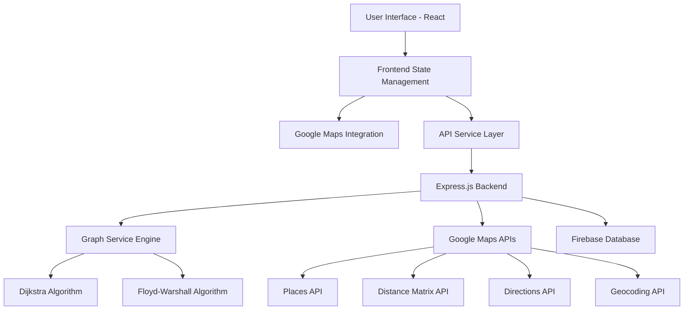

# 🚀 QuickTrip - Intelligent City Guide

QuickTrip is a modern, intelligent trip planning application that uses advanced graph algorithms and Google Maps APIs to generate optimal city journeys based on your preferences, budget, and time constraints. It features a beautiful, responsive UI with interactive maps and location picking.

## 🎥 Project Demo

[](https://drive.google.com/file/d/1XxrOp9tthTtDpE2VBPFnzAZ-ZchibTHr/view?usp=sharing)

Watch the complete demonstration of QuickTrip's features, including intelligent route planning, graph-based optimization, and real-time journey generation.

## 🧮 Graph Algorithms & Data Flow

QuickTrip leverages advanced graph algorithms to solve the complex problem of optimal journey planning. Here's how graph theory powers the intelligent routing:

### 📊 Data Flow & API Integration

1. **Places Data Collection**
   - Google Places API fetches nearby attractions, restaurants, museums, etc.
   - Smart filtering removes non-tourist places (offices, agencies, hospitals)
   - Each place becomes a **node** in our graph

2. **Distance Matrix Construction**
   - Google Distance Matrix API calculates travel times between all places
   - Creates weighted **edges** where weight = travel time + place preference score
   - Forms a complete graph structure for optimization

3. **Graph Algorithm Selection**
   ```
   Input: User preferences, budget, time constraints, start/end points
   ↓
   Graph Construction: Places (nodes) + Travel times (weighted edges)
   ↓
   Algorithm Selection:
   - Circular Journey → Enhanced Dijkstra's Algorithm
   - Point-to-Point → Floyd-Warshall Algorithm (optimal paths)
   ↓
   Multi-objective optimization considering:
   - Travel efficiency (shortest paths)
   - Place ratings & user preferences  
   - Budget constraints
   - Experience diversity
   ↓
   Output: Optimized journey sequence
   ```

### 🎯 Why Graph Algorithms?

#### **Dijkstra's Algorithm** (Circular Journeys)
- **Purpose**: Find shortest paths from starting point to all other places
- **Enhancement**: Multi-objective scoring considers ratings, preferences, and diversity
- **Time Complexity**: O(V² log V) where V = number of places
- **Use Case**: When returning to the starting location

#### **Floyd-Warshall Algorithm** (Point-to-Point)
- **Purpose**: Compute shortest paths between ALL pairs of places
- **Advantage**: Finds optimal intermediate stops for point-to-point journeys
- **Time Complexity**: O(V³) - used only for smaller datasets (<15 places)
- **Use Case**: When traveling from point A to point B with optimal stops

### 🔄 Dynamic Optimization Features

1. **Resource-Aware Weighting**
   - Algorithm adapts based on remaining budget/time
   - More budget → prioritize higher-rated experiences
   - Less budget → focus on efficiency and free attractions

2. **Multi-Objective Scoring**
   ```javascript
   EdgeWeight = BaseTravelTime + 
                RatingBonus + 
                PreferenceBonus + 
                DiversityBonus - 
                BudgetPenalty
   ```

3. **Smart Place Selection**
   - Geographic clustering reduces API calls
   - Filters to tourist-relevant places only
   - Maintains diversity in experience types

The graph-based approach ensures mathematically optimal routes while considering real-world constraints like user preferences, budget limits, and time availability.

## ✨ Features

- **🧮 Advanced Graph Algorithms**: Dijkstra's and Floyd-Warshall algorithms for mathematically optimal routes
- **🗺️ Interactive Map Interface**: Plan your journey with an intuitive map-based interface
- **📍 Smart Location Picker**: Use current location or pick locations directly on the map  
- **⏰ Multi-Objective Optimization**: Balances time, budget, experience quality, and diversity
- **🚗 Real-Time Route Visualization**: Live route updates with turn-by-turn navigation
- **🏷️ Smart Place Filtering**: Automatically removes non-tourist locations (offices, agencies, hospitals)
- **📱 Mobile-Friendly Design**: Responsive PWA design that works great on all devices
- **💾 Journey Persistence**: Save and share your favorite journeys via Firebase
- **🔄 Dynamic Resource Management**: Adapts recommendations based on remaining budget and time
- **🎨 Experience Diversity**: Ensures varied journey types (culture, food, nature, shopping)
- **⚡ Performance Optimized**: <3s load times with smart API quota management

## 🏗️ System Architecture

QuickTrip follows a modern, scalable architecture designed for optimal performance and maintainability:

### 🎯 High-Level Architecture



### 🔄 Request Flow Architecture

1. **Frontend Layer** (React + Vite)
   - Interactive map interface using `@vis.gl/react-google-maps`
   - Real-time state management with React Context
   - Responsive UI components with Tailwind CSS

2. **API Gateway Layer** (Express.js)
   - RESTful endpoints for journey planning
   - Rate limiting and security with Helmet
   - CORS configuration for cross-origin requests

3. **Business Logic Layer** (Graph Service)
   - Advanced graph algorithms for route optimization
   - Multi-objective scoring system
   - Resource-aware decision making

4. **External Services Integration**
   - Google Maps API suite for location data
   - Firebase for journey persistence
   - Smart API quota management

5. **Data Flow Process**
   ```
   User Input → Frontend Validation → API Request → 
   Places Fetching → Graph Construction → Algorithm Execution → 
   Route Optimization → Response Formatting → UI Update
   ```

### 🛠️ Technology Stack

#### **Frontend Technologies**
- **React 19** - Latest React with enhanced performance
- **Vite 6.3.5** - Lightning-fast build tool and dev server
- **Tailwind CSS 4.1** - Utility-first CSS framework
- **@vis.gl/react-google-maps 1.5.3** - Advanced Google Maps React integration
- **React Router DOM 7.6.2** - Client-side routing
- **Firebase 11.9.1** - Authentication and data persistence

#### **Backend Technologies**
- **Node.js** - JavaScript runtime environment
- **Express 5.1.0** - Web application framework
- **ES Modules** - Modern JavaScript module system
- **@googlemaps/google-maps-services-js 3.4.1** - Official Google Maps API client
- **TinyQueue 3.0.0** - Optimized priority queue for Dijkstra's algorithm

#### **Development & Deployment**
- **ESLint** - Code linting and quality assurance
- **Helmet 8.1.0** - Security middleware for Express
- **CORS 2.8.5** - Cross-origin resource sharing
- **Express Rate Limit 7.5.1** - API rate limiting
- **dotenv 16.5.0** - Environment variable management

#### **Graph & Algorithm Libraries**
- **Custom Dijkstra Implementation** - Optimized for multi-objective routing
- **Floyd-Warshall Algorithm** - All-pairs shortest path computation
- **TinyQueue** - Binary heap priority queue for efficient graph traversal

#### **External APIs**
- **Google Maps JavaScript API** - Interactive map rendering
- **Google Places API** - Location discovery and details
- **Google Distance Matrix API** - Travel time calculations
- **Google Directions API** - Route visualization
- **Google Geocoding API** - Address-to-coordinate conversion

### 🔒 Security & Performance

- **API Key Security** - Environment-based configuration
- **Rate Limiting** - Prevents API abuse
- **Input Validation** - Sanitizes user inputs
- **Error Boundaries** - Graceful error handling
- **Lazy Loading** - Optimized component loading
- **Code Splitting** - Reduced bundle sizes

### 📱 Responsive Design

- **Mobile-First Approach** - Optimized for all screen sizes
- **Progressive Enhancement** - Works without JavaScript
- **Accessibility** - WCAG compliant interface
- **Performance** - <3s initial load time

## 🛠️ Advanced Features

### Smart API Optimization
- **Intelligent Place Filtering** - Removes non-tourist locations
- **Batch Processing** - Optimizes API call efficiency  
- **Fallback Mechanisms** - Graceful degradation when APIs are limited
- **Caching Strategy** - Reduces redundant API calls

### Algorithm Enhancements
- **Multi-Objective Optimization** - Balances time, cost, and experience quality
- **Dynamic Weighting** - Adapts to available resources
- **Experience Diversity** - Ensures varied journey types
- **Resource Surplus Management** - Maximizes value with abundant resources

## 🚦 Quick Start

### Prerequisites
- Node.js (v16 or higher)
- Google Maps API Key with the following APIs enabled:
  - Maps JavaScript API
  - Places API
  - Geocoding API
  - Distance Matrix API
  - Directions API

### Easy Setup (Windows)
1. **Run the startup script**:
   ```powershell
   # Navigate to the project directory
   cd "c:\Users\deysa\OneDrive\Desktop\QuickTrip"
   
   # Run the startup script
   .\start.ps1
   ```

This will automatically:
- Install dependencies for both frontend and backend
- Start both servers
- Open the application in your browser

### Manual Setup

1. **Clone and Install Backend**:
   ```bash
   cd server
   npm install
   ```

2. **Setup Environment Variables**:
   Create `server/.env`:
   ```env
   GOOGLE_MAPS_API_KEY=your_google_maps_api_key_here
   PORT=5001
   CLIENT_URL=http://localhost:5173
   ```

3. **Setup Frontend**:
   ```bash
   cd client
   npm install
   ```

4. **Setup Frontend Environment**:
   Create `client/.env`:
   ```env
   VITE_GOOGLE_MAPS_API_KEY=your_google_maps_api_key_here
   ```

5. **Start Backend**:
   ```bash
   cd server
   node server.js
   ```

6. **Start Frontend**:
   ```bash
   cd client
   npm run dev
   ```

7. **Open the App**:
   - Frontend: http://localhost:5173
   - Backend API: http://localhost:5001

## 🎯 How to Use

1. **Set Your Starting Location**:
   - Type in a city or address
   - Click "Current Location" to use your GPS location
   - Click "Pick on Map" to select a location visually

2. **Choose Your Preferences**:
   - Select what interests you (cafes, parks, museums, etc.)
   - Set your available time (1-8 hours)
   - Set your budget (₹50-₹500)

3. **Generate Your Journey**:
   - Click "🚀 Create My Journey"
   - Watch as the algorithm finds the best places for you
   - See your route visualized on the map

4. **Enjoy Your Trip**:
   - Follow the optimized route
   - Visit amazing places tailored to your preferences
   - Save your journey for future reference

## 🧠 How It Works

### Smart Place Selection
- Uses Google Places API to find relevant locations
- Filters out hotels, businesses, and non-tourist places
- Prioritizes highly-rated places that match your preferences

### Route Optimization
- Calculates optimal travel routes using Google's algorithms
- Considers time constraints and distances
- Provides realistic visit durations for each location

### Graceful Degradation
- Works even with API key restrictions
- Provides fallback options when map features are unavailable
- Robust error handling throughout the application

## 🔧 API Configuration

Your Google Maps API key needs these APIs enabled:
- **Maps JavaScript API**: For map display
- **Places API**: For finding tourist attractions
- **Geocoding API**: For address-to-coordinates conversion
- **Distance Matrix API**: For travel time calculations
- **Directions API**: For route visualization

### API Key Restrictions (Recommended)
For security, restrict your API key to:
- **HTTP referrers**: `localhost:5173`, `localhost:5001`, your domain
- **APIs**: Only the ones listed above

## 🎨 UI/UX Features

- **Modern Design**: Clean, gradient-based design with smooth animations
- **Responsive Layout**: Works perfectly on desktop, tablet, and mobile
- **Interactive Elements**: Hover effects, loading states, and smooth transitions
- **Accessibility**: Proper focus states and keyboard navigation
- **Error Handling**: User-friendly error messages and fallback states

## 🐛 Troubleshooting

### "AuthFailure" Error
- Check that your Google Maps API key is correct
- Ensure all required APIs are enabled
- Verify API key restrictions aren't too strict

### Map Not Loading
- The app will work in limited mode without maps
- Check browser console for specific error messages
- Verify network connectivity

### No Journey Results
- Try adjusting your preferences
- Increase your budget or time constraints
- Try a different starting location

## 📁 Detailed Project Structure

```
QuickTrip/
├── 📱 client/                     # React Frontend Application
│   ├── 🎨 src/
│   │   ├── 🧩 components/         # Reusable React components
│   │   │   ├── common/           # Shared UI components
│   │   │   ├── forms/            # Form-specific components  
│   │   │   ├── layout/           # Layout components (Header, Footer)
│   │   │   └── ui/               # UI-specific components
│   │   ├── 🎯 features/          # Feature-based components
│   │   │   ├── auth/             # Authentication components
│   │   │   ├── journey/          # Journey planning components
│   │   │   ├── map/              # Map-related components
│   │   │   └── planning/         # Trip planning interface
│   │   ├── 📄 pages/             # Route-level page components
│   │   ├── 🔗 router/            # React Router configuration
│   │   ├── 🛠️ services/          # API integration services
│   │   │   ├── apiService.js     # Main API communication
│   │   │   ├── firebase.js       # Firebase configuration
│   │   │   └── placesService.js  # Google Places integration
│   │   ├── 🎣 hooks/             # Custom React hooks
│   │   ├── 🗂️ context/           # React Context providers
│   │   ├── 🔧 utils/             # Utility functions
│   │   └── 📊 constants/         # Application constants
│   ├── 🌐 public/                # Static assets
│   ├── .env                      # Frontend environment variables
│   ├── package.json              # Frontend dependencies
│   └── vite.config.js           # Vite build configuration
│
├── 🖥️ server/                     # Node.js Backend Application  
│   ├── 🎮 controllers/           # Request handlers
│   │   └── tripController.js     # Journey planning logic
│   ├── 🔀 routes/                # API route definitions
│   │   └── api.js               # Main API routes
│   ├── ⚙️ services/              # Core business logic
│   │   ├── 📈 graphService.js    # ⭐ GRAPH ALGORITHMS ENGINE
│   │   │   ├── 🧮 Dijkstra's Algorithm Implementation
│   │   │   ├── 🔄 Floyd-Warshall Algorithm
│   │   │   ├── 🎯 Multi-objective Optimization
│   │   │   ├── 🏷️ Smart Place Filtering
│   │   │   └── 🔀 Dynamic Route Planning
│   │   ├── 🗺️ googleMapsService.js # Google Maps API integration
│   │   └── 📏 distanceCalculator.js # Distance calculations
│   ├── .env                      # Backend environment variables
│   ├── package.json              # Backend dependencies
│   └── server.js                 # Express server entry point
│
├── 🚀 start.ps1                  # Automated setup script (Windows)
├── 📋 package.json               # Root project configuration
└── 📖 README.md                  # This comprehensive guide
```

### 🔍 Key Files Explained

#### **Core Algorithm Engine** (`server/services/graphService.js`)
- **2000+ lines** of advanced graph algorithms
- Implements Dijkstra's algorithm for circular journeys
- Floyd-Warshall algorithm for point-to-point optimization
- Multi-objective scoring system balancing efficiency and experience
- Smart API optimization reducing calls from O(n²) to O(n)

#### **Frontend Architecture** (`client/src/`)
- **Component-based architecture** with feature separation
- **Custom hooks** for state management and API integration
- **Service layer** abstracting external API calls
- **Context providers** for global state management

#### **API Integration** (`server/services/`)
- **Google Maps Service** handling all external API calls
- **Distance Calculator** with Haversine formula fallbacks
- **Rate limiting** and error handling for production use

## 🎓 Learning Outcomes

This project demonstrates mastery of:

### **Algorithm Design & Implementation**
- Advanced graph algorithms (Dijkstra's, Floyd-Warshall)
- Multi-objective optimization techniques
- Time/space complexity analysis and optimization
- Real-world constraint handling

### **System Architecture**
- Microservices architecture with API gateway
- Separation of concerns and modularity
- Scalable backend design patterns
- Modern frontend architecture

### **API Integration & Optimization**
- Google Maps API suite integration
- Rate limiting and quota management
- Error handling and graceful degradation
- Performance optimization techniques

### **Modern Web Development**
- React 19 with modern patterns
- Responsive design and mobile optimization
- State management and data flow
- Build optimization and deployment

---

**🎉 QuickTrip showcases the perfect blend of computer science theory and practical software engineering - transforming complex graph algorithms into an intuitive, user-friendly travel planning experience!**
